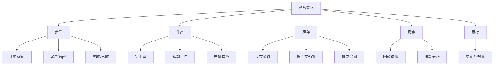
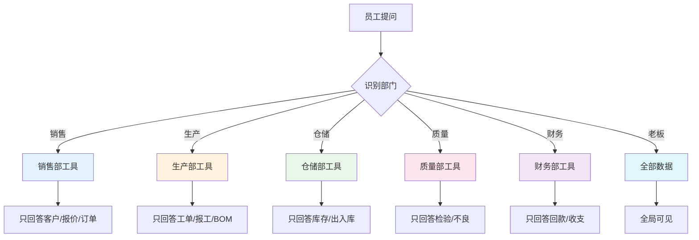
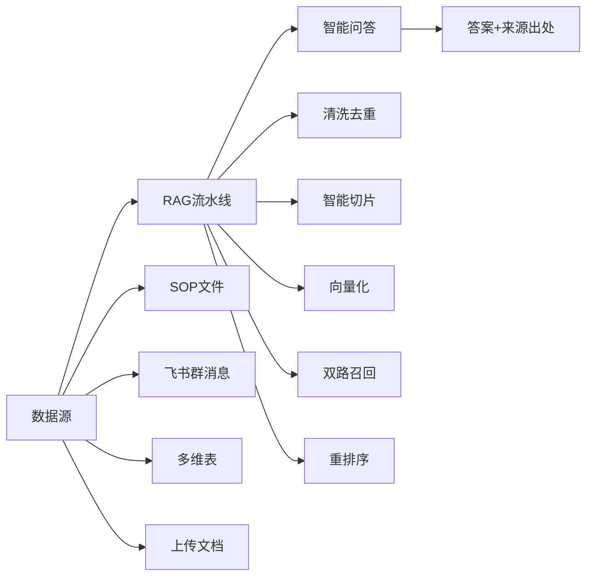
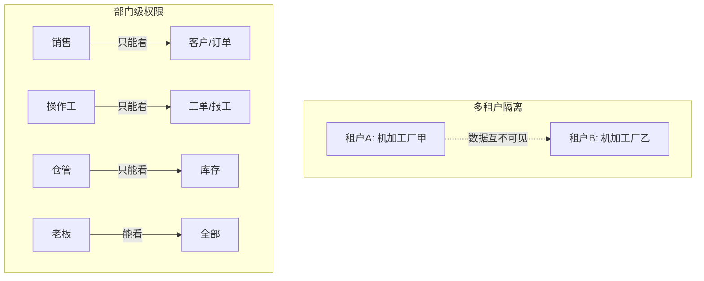
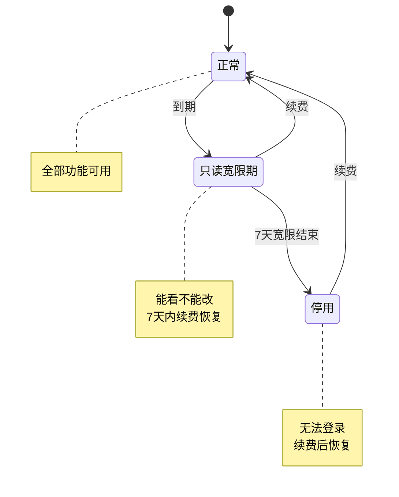
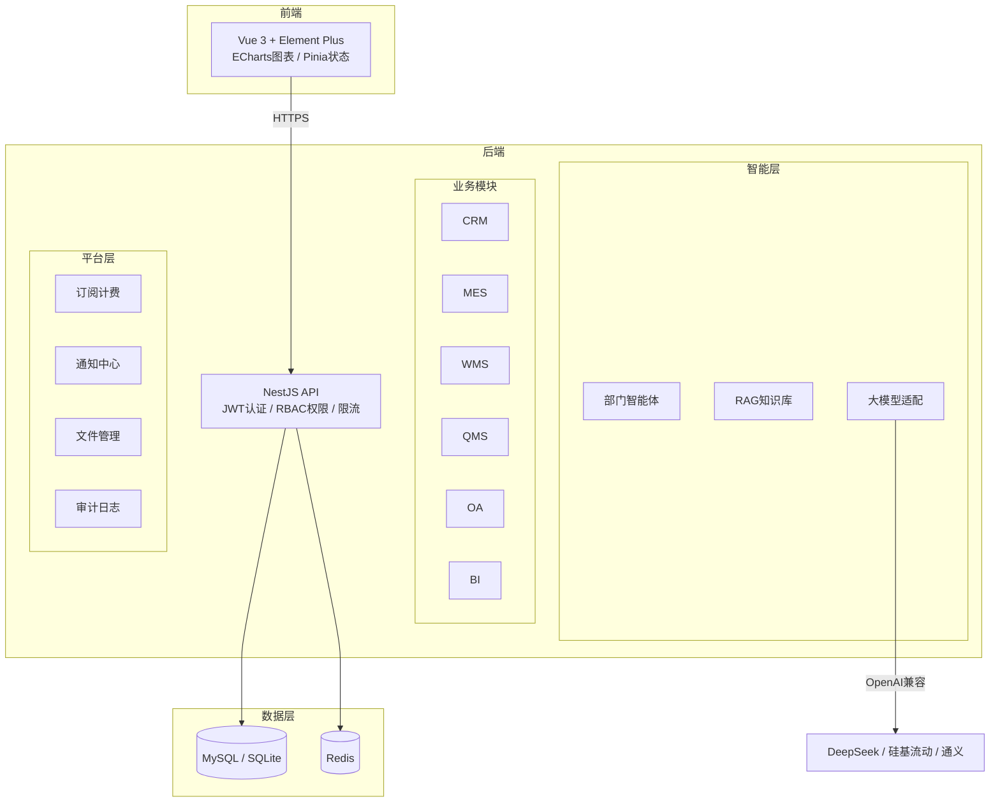
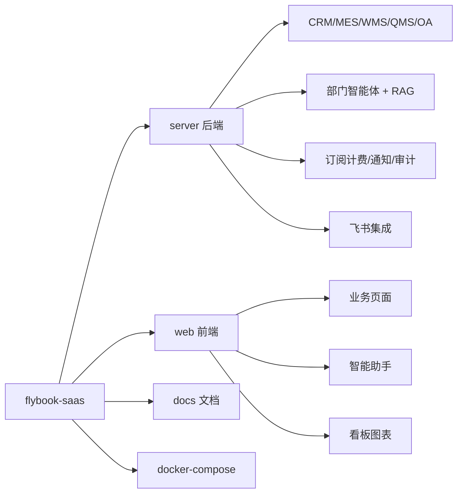

# 飞书智造云

> 面向中小机械制造业的一体化数字化管理平台
> CRM · ERP/MES · 部门智能体 · RAG知识库 · 飞书协同

**在线演示：** https://985e62d.r6.cpolar.cn （账号 `admin` / 密码 `123456`）

> ⚠️ 演示地址是内网穿透出来的，带宽跟蜗牛散步似的，加载慢请耐心等一会儿，它不是死了，是在努力喘气。

---

## 这是什么

一套开箱即用的多租户 SaaS，把机加工厂从「Excel + 纸质单 + 微信群」升级为全链路在线系统，并在每个部门嵌入了数据隔离的智能助手。


整条链路在一个系统里完成，数据自动流转，老板打开看板就能看到经营全貌。

---

## 解决什么痛点

| 现在的问题 | 用系统后 |
|-----------|---------|
| 客户信息在销售个人微信里，人走客户丢 | 客户档案集中管理，跟进记录可追溯 |
| 报价靠 Excel，成本算不准 | BOM 自动展开，成本一键核算 |
| 工单进度靠打电话问车间 | 扫码报工，进度实时可见 |
| 库存数量不清，经常停工等料 | 实时库存 + 低库存自动预警 |
| 质量问题靠口头交接 | 检验单 + 不良处理流程闭环 |
| 月底对账才知道收了多少钱 | 应收已收一目了然 |
| 老板想看数据得找人统计 | 打开看板就是最新数据 |

---

## 系统能做什么

### 经营全貌（老板视角）



### 各部门用什么

| 部门 | 核心功能 | 看到的数据 |
|------|---------|-----------|
| **销售部** | 客户档案、报价、订单跟踪、回款 | 客户/报价/订单/回款 |
| **生产部** | 工单管理、派工、扫码报工、进度跟踪 | 工单/报工/BOM |
| **仓储部** | 库存查询、出入库、批次管理 | 库存/出入库记录 |
| **质量部** | 来料检验、工序检验、成品检验、不良处理 | 检验单/缺陷记录 |
| **财务部** | 对账、回款登记、成本汇总 | 订单回款/收支 |
| **人事行政部** | 请假审批、加班登记、人员管理 | 审批流程/人员 |
| **总经办** | 全局看板、所有模块、智能问答 | 全部数据 |

---

## 部门智能体

每个部门都有一个专属 AI 助手，**只能看到自己部门的数据**，不会串。



**隔离怎么保证的？**

- 每个部门只配了自己的查询工具，AI 根本没有权限碰其他部门的数据
- 每次调用工具前，系统再校验一次「这个工具你这个部门能不能用」
- 不是靠 AI 自觉，是代码层面硬拦截

**智能体能做什么：**

- 直接问数据：「本月有多少订单没交货」「库存低于安全线的物料有哪些」
- 看思考过程（可开关）：AI 怎么一步步得出答案，透明可追溯
- 群里 @机器人 也能问：财务群里问「本月回款多少」，只回答财务数据
- 对话评价：每条回答可以点赞/点踩，持续优化

---

## RAG 知识库

把公司的 SOP 文件、操作手册、群聊记录都喂进去，员工直接问就行。



回答会标注出处，知道答案来自哪份文件的哪一段。文档按部门隔离，销售问不到生产部的 SOP。

---

## 数据安全与权限



- **多租户**：每家工厂数据完全隔离，共享代码库但数据互不可见
- **菜单隐藏**：销售登录看不到生产/仓储菜单，前端后端双重控制
- **登录锁定**：连续输错 5 次密码锁 15 分钟
- **操作审计**：所有增删改操作自动记录，谁在什么时候做了什么
- **敏感脱敏**：手机号、身份证、金额在日志中自动打码

---

## 订阅计费

| 套餐 | 月付 | 年付 | 用户数 | 智能体 | 适合 |
|------|------|------|--------|--------|------|
| 标准版 | ¥299 | ¥2,990 | 10人 | 100次/天 | 小团队起步 |
| 专业版 | ¥799 | ¥7,990 | 100人 | 不限 | 成长期工厂 |

到期后系统自动处理，不用人工盯：



- 到期前 7 天 / 3 天 / 1 天，系统自动发站内通知提醒
- 可设置自动续费，到期自动续一个月
- 每天凌晨自动检查，无需人工干预

---

## 飞书集成

```mermaid
flowchart LR
    subgraph 飞书侧
        FS[飞书工作台]
        FG[部门群]
        FAPP[自建应用]
    end

    subgraph 系统侧
        SSO[一键登录]
        AGENT[智能体]
        PUSH[预警推送]
    end

    FS -->|扫码登录| SSO
    FG -->|@机器人提问| AGENT
    AGENT -->|群内回复| FG
    SYS[业务事件] --> PUSH
    PUSH -->|低库存/延期/待审批| FG
```

- **一键登录**：不用记账号密码，飞书扫码直接进系统
- **群里问数据**：在财务群 @机器人问「本月回款」，自动回答
- **自动推送**：低库存、工单延期、待审批，自动推到对应群
- **不装飞书也能用**：飞书是加分项，不是必需品，系统独立可用

---

## 怎么开始用

### 30 秒跑起来（开发体验）

```bash
git clone https://github.com/M9T040705/M9T-lark-manufacturing.git
cd M9T-lark-manufacturing

# 后端
cd server && cp .env.example .env && npm install && npx prisma db push && npm run dev

# 前端（新开终端）
cd web && npm install && npm run dev
```

打开 http://localhost:5173，用 `demo / admin / 123456` 登录。

### 正式部署（Docker）

```bash
cp .env.production.example .env
# 修改数据库密码、JWT密钥、域名
docker compose up -d --build
```

一条命令拉起 MySQL + Redis + 后端 + Nginx，自动建表写入演示数据。

### 演示账号

| 角色 | 账号 | 能看到什么 |
|------|------|-----------|
| 老板 | `admin` | 全部模块 + 智能体 + 看板 |
| 销售 | `sales01` | 客户/订单/智能助手 |
| 生产经理 | `manager01` | 工单/报工/智能助手 |
| 操作工 | `worker01` | 扫码报工 |
| 仓管 | `warehouse01` | 库存/出入库 |
| 质检 | `quality01` | 检验/不良处理 |
| 财务 | `finance01` | 回款/对账 |
| 人事 | `hr01` | 审批/人员 |

---

## 技术架构



| 层 | 选型 | 为什么 |
|----|------|--------|
| 后端 | NestJS + TypeScript | 模块化、类型安全、企业级 |
| ORM | Prisma | 自动生成类型、迁移管理 |
| 前端 | Vue 3 + Element Plus | 后台管理生态成熟、上手快 |
| 数据库 | SQLite（开发）/ MySQL（生产） | 零依赖起步，生产可切换 |
| 大模型 | OpenAI 兼容接口 | DeepSeek/硅基流动/通义随便换 |
| 部署 | Docker Compose | 一键部署，不挑服务器 |

---

## 项目结构



---

## 开源协议

MIT，随便用、随便改。商用免费，不承担任何责任。

---

> 有问题提 Issue，欢迎 Star 和 PR。
